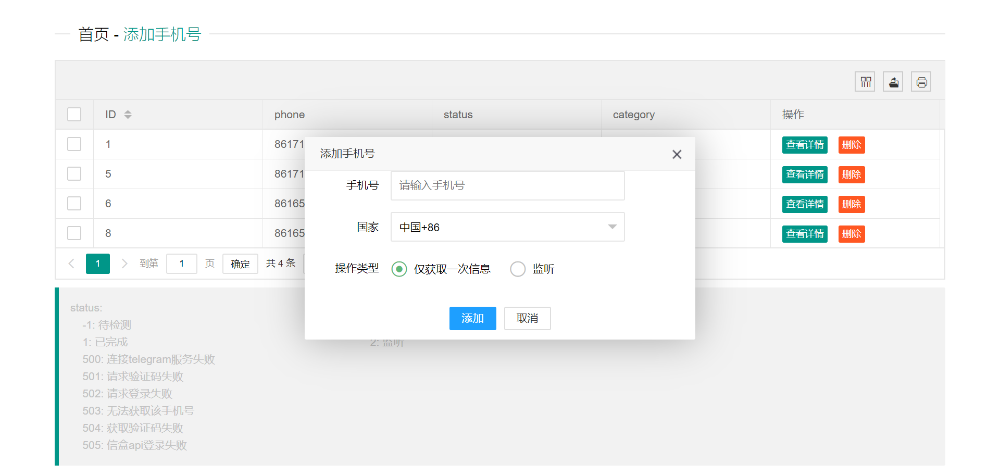
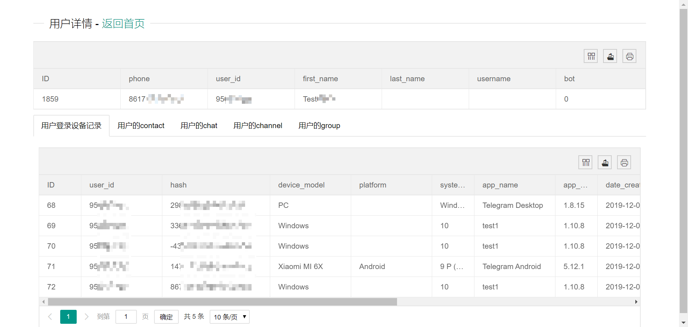

# telegram_spider
利用telethon获取telegram信息，并前端展示

本程序能实现
1. telegram账号相关信息的获取（包括个人资料、登录历史、群组成员和历史消息等）
2. telegram私聊会话的消息监听

## 安装
1. 安装python所需的第三方库，在文件根目录能找到`requirem.txt`
```
pip install -r requirements.txt
```
2. 创建数据库`telegram`，导入根目录下的`telegram.sql`

## 配置
### 数据获取
1. 使用telegram api前必须要先拥有你自己的api_id和api_hash，可以在[这里](https://my.telegram.org/)注册，更多telethon的相关使用请查看[官方文档](https://docs.telethon.dev/en/latest/index.html#)
2. 本程序为了自动化通过信盒api来获取手机验证码，也需要注册相应的账户。（也可自行修改相关代码换为手动输入验证码）
3. 修改`telegram_spiders/spider`目录下的`config.py`文件，更换为自己的相关信息
```python
# telethon_api
api_id = "your api_id"
api_hash = "your api_hash"

# file
sessions_dir = "sessions/"
images_dir = "images/"

# 信盒api账号
message_name = "your api name"
message_password = "your api password"
message_sid = 3645 # telegram项目代号

# 数据库
host = "127.0.0.1"
port = 3306
user = "your db user"
password = "your db password"
db = "telegram"
```

### 数据展示
数据展示采用`springboot+layui`实现

修改`telegram_display/src/main/resources/`目录下的`application.properties`文件，更换为自己的数据库连接信息
```java
#数据库连接信息
spring.datasource.driver-class-name=com.mysql.cj.jdbc.Driver
spring.datasource.url=jdbc:mysql://127.0.0.1:3306/telegram
spring.datasource.username=root
spring.datasource.password=123
```

## 运行
### 数据获取
在`telegram_spiders/spider`目录下执行

信息获取程序
```
python main.py
```

监听程序
```
python monitor_main.py
```

### 数据展示
运行`telegram_display/src/main/java/com/milulost/telegram_display`目录下的`TelegramDisplayApplication.java`

## 使用
1. 在前端添加手机号，选择不同的功能

2. 等待数据获取后点击对应手机号的`查看详情`选项可以看到对应的相关信息
